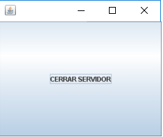
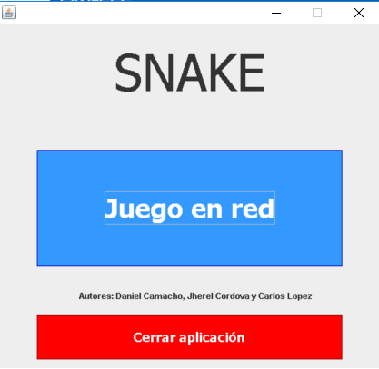
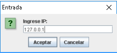
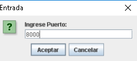
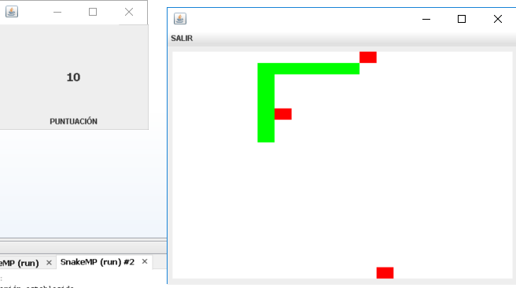

## SNAKE GAME  
------------  
Este código está creado por el gupo de MP formado por Daniel Camacho, Carlos Lopez y Jherel Cordova, para la práctica obligatoria de la asignatura Metodología de la Programación.  
El objetivo de esta práctica es familiarizarnos con los patrones de diseño, en concreto con el Modelo-Vista-Controlador (MVC) y el Observer.  
Para ello, se nos pide contruir el famoso juego de la serpiente.  
  
La aplicación de los patrones descritos anteriormente se realiza dividiendo el juego en 2 partes: un servidor y un cliente; cada uno con sus clases de modelo, vista y controlador. Además, el servidor observa lo que hace el cliente.  
  
Para ejecutar con éxito esta aplicación, primero tenemos que importar el proyecto en nuestro IDE (preferiblemente NetBeans, donde ha sido desarrollado), después, se tiene que ejecutar primero el archivo PrincipalServidor.java, para que el mismo se inicie y, a continuación, el archivo PrincipalCliente.java.  
  
Al abrir el archivo PrincipalCliente.java, se nos mostrará una ventana principal con los botones de iniciar el juego, cerrar la aplicación, y los nombres de los integrantes del grupo. Una vez se haga clic sobre iniciar juego, se deben insertar como IP: 127.0.0.1 y, como puerto, el 8000, dado que se realiza sobre un servidor local. Una vez hecho esto, se iniciará el juego de la serpiente y solo queda disfrutar. Cabe decir que esta ventana posee un boton para salir de ella.  
  
------------  
## ANEXO  
------------  
A continuación, se muestras imágenes de las distintas pantallas de la aplicación:  
  
* Pantalla de servidor:  
  
  
* Pantalla principal del juego:  
  
  
* Pantallas de introducción de IP y puerto:  
  
  
  
* Pantalla de juego con puntuación:  
  
  
------------  
